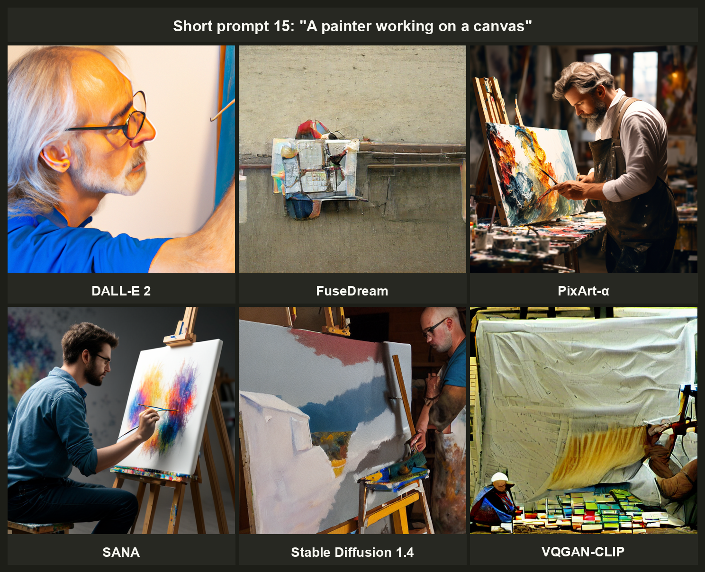

# PRISM-36K

**PRISM-36K** is a benchmark dataset of 36,000 AI-generated images designed for model-attribution research.


It accompanies the paper
> "PRISM: Phase-enhanced Radial-based Image Signature Mapping for AI-Generated Image Attribution"  
> E. Ricco, E. Onofri, L. Cima, S. Cresci, R. Di Pietro 2025; arXiv:2509.15270

The image-generation scripts used to produce this dataset are released in a separate GitHub repository at [emarich18-res/PRISM-36K](https://github.com/emarich18-res/PRISM-36K). The PRISM classifier and evaluation code will be released upon full paper acceptance.

The dataset provides a controlled, prompt-matched collection of 512 × 512 PNG images from six text-to-image (T2I) generators, together with the 100 train/test splits used in the paper and a designated _average_ split for reproducible benchmarking.

[](https://doi.org/10.5281/zenodo.20038953)
[](LICENSE.txt)
[](https://arxiv.org/abs/2509.15270)
[](https://github.com/emarich18-res/PRISM-36K)

---

## At a glance

| Property | Value |
|---|---|
| Total images | 36,000 |
| Resolution | 512 × 512 px, PNG (lossless) |
| Generators | 6 |
| Images per generator | 6,000 (40 prompts × 150 generations) |
| Prompt set | 40 author-written English prompts (20 short + 20 long, paired) |
| Train/test splits | 100 random splits; one canonical "average split" |
| Total size | ~16 GB |

---

### Generators included

| Folder | Model | Reference |
|---|---|---|
| `dalle2/` | DALL-E 2 | Ramesh et al., 2022 |
| `fusedream/` | FuseDream | Liu et al., 2021 |
| `pixart/` | PixArt-α | Chen et al., 2024 |
| `sana/` | SANA | Xie et al., 2024 |
| `sd/` | Stable Diffusion 1.4 | Rombach et al., 2022 |
| `vqgan/` | VQGAN-CLIP | Esser et al., 2021 |

---

### Sample images

The same prompt issued to all six generators.



## Repository structure

```
PRISM-36K/
├── README.md                   # this file
├── LICENSE.txt                 # CC BY-NC-SA 4.0 + DALL-E 2 and NVIDIA-SANA caveat
├── CITATION.cff                # CFF 1.2.0 citation metadata
├── CHANGELOG.md                # version history
├── teaser.png                  # teaser image for the README.md
├── metadata/
│   ├── prompts.csv             # prompt_id, length, pair_id, prompt text
│   └── images.csv              # filename, model, prompt_id, iter, sha256, width, height
├── splits/
│   ├── average_split.json      # canonical split used for paper figures and tables
│   └── splits_100.csv          # all 100 splits (long format: prompt_id, split_id, partition)
├── images/                     # Provided as images.zip
│   ├── dalle2/
│   ├── fusedream/
│   ├── pixart/
│   ├── sana/
│   ├── sd/
│   └── vqgan/
└── checksums/
    └── SHA256SUMS              # one SHA-256 entry per image, BSD-style
```

---

### Image filename convention

```
<ModelName>_<promptid>_<iter>.png
```

- `<ModelName>` matches the folder name exactly (e.g., `dalle2`)
- `<promptid>` ∈ 1–40
- `<iter>` ∈ 1–150

Example: `sana_7_42.png` — 42nd generation of prompt 7 with SANA.

---

### Integrity verification

After downloading, verify all images against `checksums/SHA256SUMS` using the
bundled script:

```bash
python generate_checksums.py --verify \
    --root      images \
    --output    checksums/SHA256SUMS \
    --include-metadata \
    --pattern   '*.png'
```

If Python is unavailable, the standard POSIX tool works directly:

```bash
sha256sum -c checksums/SHA256SUMS
```

All 36,000 files should report `OK`. Any failure indicates a corrupt or incomplete download.

---

## Loading the metadata

```python
import pandas as pd

images  = pd.read_csv("metadata/images.csv")
prompts = pd.read_csv("metadata/prompts.csv")

# Example: all SANA images generated from short prompts
subset     = images.merge(prompts, on="prompt_id")
sana_short = subset[(subset["model"] == "sana") & (subset["length"] == "short")]
```

---

## Reproducing the splits used in the paper

The paper reports results over 100 random stratified train/test splits (`splits/splits_100.csv`) and designates one **average split** (`splits/average_split.json`) as the canonical reference for confusion matrices and feature visualisations.
The average split is the split whose per-metric performance vector has minimum sum of squared deviations from the 100-split mean.

Splits are defined at the **prompt level**: each entry identifies which prompt IDs are assigned to the training or test partition. All 150 × 6 = 900 images for a given prompt belong to the same partition.

**Loading the average split:**

```python
import json
import pandas as pd

with open("splits/average_split.json") as f:
    split = json.load(f)

# split["train"] / split["test"]: lists of prompt_ids (int)
train_prompt_ids = split["train"]
test_prompt_ids  = split["test"]

images = pd.read_csv("metadata/images.csv")
train  = images[images["prompt_id"].isin(train_prompt_ids)]
test   = images[images["prompt_id"].isin(test_prompt_ids)]
```

**Iterating over all 100 splits:**

```python
import pandas as pd

splits = pd.read_csv("splits/splits_100.csv")
# columns: prompt_id, split_id, partition  (partition ∈ {"train", "test"})

images = pd.read_csv("metadata/images.csv")

for split_id, group in splits.groupby("split_id"):
    train_prompts = group[group["partition"] == "train"]["prompt_id"]
    test_prompts  = group[group["partition"] == "test"]["prompt_id"]
    train = images[images["prompt_id"].isin(train_prompts)]
    test  = images[images["prompt_id"].isin(test_prompts)]
    # ... fit / evaluate
```

For exact reproduction of the PRISM classifier itself, see the companion code repository (§ Companion code below).

---

## Citation

If you use PRISM-36K in your work, please cite both the paper and the dataset record.

**Paper (BibTeX):**

```bibtex
@article{ricco2025prism,
  author  = {Ricco, Emanuele and Onofri, Elia and Cima, Lorenzo
             and Cresci, Stefano and {Di Pietro}, Roberto},
  title   = {{PRISM}: Phase-enhanced Radial-based Image Signature Mapping
             for {AI}-Generated Image Attribution},
  journal = {arXiv preprint arXiv:2509.15270},
  year    = {2025},
  doi     = {10.48550/arXiv.2509.15270},
  url     = {https://arxiv.org/abs/2509.15270}
}
```

**Dataset record (BibTeX):**

```bibtex
@dataset{ricco2025prism_data,
  author    = {Ricco, Emanuele and Onofri, Elia and Cima, Lorenzo
               and Cresci, Stefano and {Di Pietro}, Roberto},
  title     = {{PRISM-36K}: A Benchmark Dataset for AI-Generated Image Attribution},
  year      = {2025},
  publisher = {Zenodo},
  doi       = {10.5281/zenodo.20038953},
  url       = {https://doi.org/10.5281/zenodo.20038953}
}
```

A machine-readable citation is also available in [`CITATION.cff`](CITATION.cff).

---

## License

**Images and metadata:** [Creative Commons Attribution-NonCommercial-ShareAlike 4.0 International (CC BY-NC-SA 4.0)](LICENSE.txt).
You are free to share and adapt the material for any purpose, provided you give appropriate credit, link to the license, and indicate if changes were made.

**Note on DALL-E 2 images.** The 6,000 images in `images/dalle2/` were generated via OpenAI's paid API and are subject to OpenAI's usage policies in addition to CC BY-NC-SA 4.0.
Users intending to use these images for purposes beyond academic research should consult OpenAI's current terms of service.

**Note on NVIDIA-SANA images.** The 6,000 images in `images/sana/` are licensed under the Apache License 2.0 usage policies in addition to CC BY-NC-SA 4.0.

---

## Companion code

- **Generation scripts** — the code used to issue prompts to each generator and produce this dataset is maintained at [github.com/emarich18-res/PRISM-36K](https://github.com/emarich18-res/PRISM-36K).
- **PRISM classifier and evaluation code** — released upon full paper acceptance.

---

## Contact / Issues

For bug reports, questions about the dataset, or collaboration enquiries, please contact:

**Elia Onofri** — `elia[dot]onofri[at]kaust[dot]edu[dot]sa`  
Cybersecurity Research and Innovation Laboratory (CRI-Lab)  
King Abdullah University of Science and Technology (KAUST), Saudi Arabia